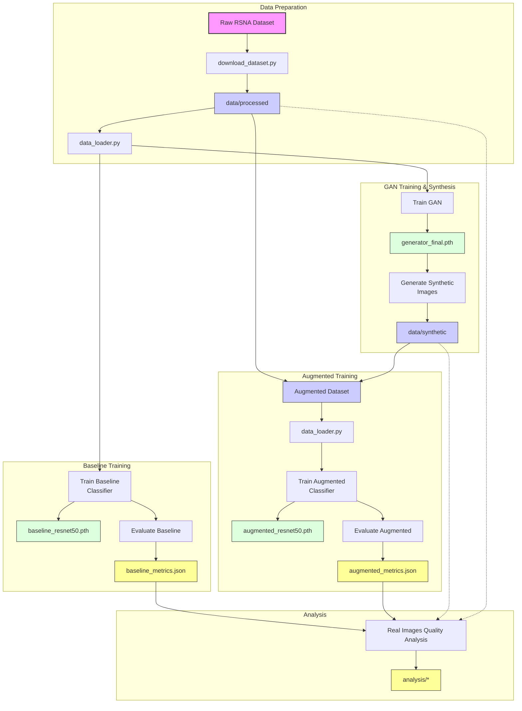

# gan-enhanced-pneumonia-classifier

Enhancing Pneumonia Detection with GAN-Generated Synthetic Chest X-rays

## Table of Contents
- [Task](#1-task)
- [Related Work](#2-related-work)
- [Approach](#3-approach)
- [Dataset and Metrics](#4-dataset-and-metrics)
- [File Structure](#5-file-structure)
- [Setup and Usage](#6-setup-and-usage)
  - [Prerequisites](#prerequisites)
  - [Installation](#installation)
  - [Dataset Preparation](#dataset-preparation)
  - [Training the Baseline Classifier](#training-the-baseline-classifier)
  - [Training the GAN](#training-the-gan)
  - [Generating Synthetic Images](#generating-synthetic-images)
  - [Training the Augmented Classifier](#training-the-augmented-classifier)
  - [Analyzing Results](#analyzing-results)
- [References](#7-references)

## 1. Task
This project seeks to create realistic synthetic X-ray images of lungs with pneumonia using a Generative Adversarial Network (GAN) and assess their effect on enhancing a deep learning classifier's performance. By enriching the dataset with high-quality synthetic images, we aim to boost model accuracy and generalization, especially in scenarios with scarce medical data. The difficulty is in ensuring these images maintain authentic anatomical features and pneumonia-specific traits, like lung opacities, while preventing artifacts that might confuse the classifier. The synthetic images must faithfully represent pneumonia signs without adding deceptive patterns that could harm classifier effectiveness.

## 2. Related Work
Generative Adversarial Networks (GANs) have progressed synthetic image creation in medical imaging. Goodfellow et al. (2014) pioneered GANs, achieving lifelike image generation, though initial versions grappled with instability and poor quality [1]. Frid-Adar et al. (2018) employed GANs to enhance liver lesion datasets, boosting CNN accuracy, yet struggled with realism for intricate anatomies [2]. Yi et al. (2019) surveyed GANs in medical contexts, citing X-ray augmentation wins but underscoring problems with retaining diagnostic traits [3]. Kazeminia et al. (2020) evaluated GANs for medical image tasks, stressing X-ray synthesis promise while noting challenges in pathology-specific detail capture [4]. These works expose flaws in anatomical accuracy and feature retention—gaps we tackle with conditional generation and improved loss functions.

## 3. Approach

The diagram below illustrates the overall workflow of the project, from data preparation to model training and analysis:



We implement a GAN architecture using PyTorch, based on DCGAN principles, to generate synthetic chest X-rays. While the file is named `dcgan.py`, the architecture has been streamlined for faster training:

1. **Standard DCGAN Structure**:
   - Uses a sequence of `ConvTranspose2d` (or `Upsample` + `Conv2d`) layers in the Generator and `Conv2d` layers in the Discriminator.
   - Employs `BatchNorm2d` and `ReLU`/`LeakyReLU` activations.
   - The initial progressive growing implementation has been removed; the models now train at the target resolution (224x224) directly (though the training script `train_gan.py` still contains the progressive loop structure, the `alpha` parameter is ignored by the current models).

2. **Simplified Components**:
   - Self-Attention layers have been removed.
   - Residual connections (ResBlocks) have been removed.
   - Advanced normalization techniques like Adaptive Instance Normalization (AdaIN) and Minibatch Standard Deviation have been removed.

3. **Loss Functions**: 
   - Adversarial loss using Binary Cross-Entropy with label smoothing (0.9 for real).
   - Perceptual loss using VGG16 features (relu1_2, relu2_2, relu3_3 - hardcoded) to maintain structural similarity.
   - Feature matching loss (comparing intermediate discriminator features for real and fake images) for improved training stability.

The training process involves standard GAN updates for the generator and discriminator, using the combined loss function for the generator.

Generated images undergo quality analysis using SSIM comparison with real images, focusing on structural similarity and preservation of diagnostic features. The analysis script (`src/analyze_results.py`) provides quantitative metrics and visual comparisons between real and synthetic images.

The GAN architecture aims for a balance between image quality and training efficiency.

The performance of the augmented classifier is compared against a baseline ResNet-50 trained solely on the original data.

## 4. Dataset and Metrics
The project utilizes the RSNA Pneumonia Detection Challenge dataset from Kaggle ([link](https://www.kaggle.com/c/rsna-pneumonia-detection-challenge)), specifically using a pre-processed version available at ([link](https://www.kaggle.com/datasets/iamtapendu/rsna-pneumonia-processed-dataset)). This version includes metadata files (`stage2_train_metadata.csv`, `stage2_test_metadata.csv`) and corresponding PNG images located in `Training/Images/` and `Test/` directories within the download. The training metadata contains class labels ("Normal," "No Lung Opacity/Not Normal," "Lung Opacity"), while the test metadata uses a "PredictionString" format. The dataset comprises approximately 26,684 training images and 6,671 test images (actual numbers may vary slightly based on the metadata). Our `data_loader.py` script processes this structure, converting it into a binary classification task: "Lung Opacity" is mapped to label 1 (positive class), while all other classes ("Normal", "No Lung Opacity/Not Normal") are mapped to label 0 (negative class). Standard ImageNet normalization and resizing to 224x224 via `torchvision.transforms` are applied. Our primary metric is classification accuracy, aiming for over 85% on the test set, compared against a baseline ResNet-50's performance (initially around 80%). We also track weighted precision, recall, and F1-score to account for potential class imbalance. Validation is performed using 5-fold cross-validation by default, configurable via script arguments. Synthetic image quality is assessed using SSIM between generated and real positive-class images.

## 5. File Structure
```
gan-enhanced-pneumonia-classifier/
│
├── .gitignore           # Git ignore rules
├── .gitattributes      # Git attributes configuration
├── .kaggle/            # Kaggle API credentials
├── .venv/              # Virtual environment
├── LICENSE             # Project license
├── README.md           # Project documentation
├── requirements.txt    # Project dependencies
│
├── data/
│   ├── processed/      # Location for the downloaded and extracted dataset
│   │   ├── stage2_train_metadata.csv
│   │   ├── stage2_test_metadata.csv
│   │   ├── Training/
│   │   │   └── Images/ # Training PNG images
│   │   └── Test/       # Test PNG images
│   └── synthetic/      # Generated synthetic images
│
├── models/
│   ├── baseline_resnet50.pth           # Baseline classifier
│   ├── augmented_resnet50.pth          # Augmented classifier
│   ├── best_overall_baseline_resnet50.pth    # Best CV model (baseline)
│   ├── best_overall_augmented_resnet50.pth   # Best CV model (augmented)
│   └── gan/                            # GAN model checkpoints
│       ├── generator_final.pth
│       └── discriminator_final.pth
│
├── notebooks/          # Jupyter notebooks for exploration and visualization
│
├── results/
│   ├── metrics/        # Training and evaluation metrics
│   │   ├── baseline_training_history.json
│   │   ├── baseline_final_metrics.json
│   │   ├── baseline_cv_summary.json
│   │   ├── augmented_training_history.json
│   │   ├── augmented_final_metrics.json
│   │   ├── augmented_cv_summary.json
│   │   └── gan_training_history.json
│   ├── figures/        # Performance plots and visualizations
│   │   ├── baseline_loss.png
│   │   ├── augmented_loss.png
│   │   ├── cv_comparison.png
│   │   └── gan_loss_curve.png
│   ├── analysis/       # Analysis outputs
│   │   ├── comparison_*.png            # Comparative performance plots
│   │   ├── cv_comparison.png           # CV performance comparison plot
│   │   ├── comparison_report.txt       # Detailed performance comparison report
│   │   ├── ssim_analysis.json          # SSIM analysis results
│   │   └── real_vs_synthetic_comparison.png # Example real/synthetic image pairs
│   └── gan_images/     # GAN-generated sample images during training
│
├── src/
│   ├── __init__.py
│   ├── analyze_results.py    # Results analysis, comparison, and SSIM calculation
│   ├── classifier.py         # ResNet50 model implementation
│   ├── data_loader.py       # Dataset loading and preprocessing
│   ├── dcgan.py             # GAN architecture implementation (Progressive GAN with enhancements)
│   ├── download_dataset.py   # Dataset download script
│   ├── generate_synthetic.py # Synthetic image generation
│   ├── train_classifier.py   # Classifier training script
│   ├── train_gan.py         # GAN training script
│   └── utils.py             # Utility functions
│
└── tests/              # Unit tests for source code
    └── __init__.py

```

The project follows a modular structure:

- **Source Code (`src/`)**: Core implementation files
  - Model architectures (`classifier.py`, `dcgan.py`)
  - Training scripts (`train_classifier.py`, `train_gan.py`)
  - Data handling (`data_loader.py`, `download_dataset.py`)
  - Analysis tools (`analyze_results.py`) including performance comparison and synthetic quality (SSIM/FID).

- **Data Management (`data/`)**:
  - Original dataset in `processed/`
  - Synthetic images in `synthetic/`

- **Results (`results/`)**:
  - **`metrics/`**: Raw JSON files containing training history and evaluation metrics for baseline, augmented, and GAN models.
  - **`analysis/`**: Processed analysis outputs including performance comparison plots, reports, and synthetic image quality assessments (SSIM scores, example images).
  - **`gan_images/`**: Sample images generated during GAN training for visual inspection.

- **Models (`models/`)**:
  - Saved model checkpoints for classifiers and GAN components.

Each component is designed to be modular and reusable, with clear separation of concerns between data processing, model implementation, training, and analysis.

## 6. Setup and Usage

### Prerequisites

- Python 3.7+
- PyTorch 1.9+
- CUDA-compatible GPU (optional but recommended)

### Installation

1. **Clone the repository**
   ```bash
   git clone https://github.com/yourusername/gan-enhanced-pneumonia-classifier.git
   cd gan-enhanced-pneumonia-classifier
   ```

2. **Create and activate a virtual environment**
   ```bash
   # Windows
   py -m venv .venv
   .\.venv\Scripts\activate

   # macOS/Linux
   python3 -m venv .venv
   source .venv/bin/activate
   ```

3. **Install dependencies**
   ```bash
   pip install -r requirements.txt
   ```
   *Note: `requirements.txt` now includes `scikit-image` for SSIM analysis.*

4. **Install PyTorch with CUDA support**
   ```bash
   pip install torch==2.5.1+cu121 torchvision==0.20.1+cu121 --index-url https://download.pytorch.org/whl/cu121
   ```

5. **Set up Kaggle API**
   - Create a Kaggle account at [Kaggle](https://www.kaggle.com/)
   - Go to your account settings
   - Create new API token
   - Set up credentials:
     ```bash
     # Windows (using Git Bash or similar)
     mkdir -p ~/.kaggle
     cp /path/to/downloaded/kaggle.json ~/.kaggle/
     chmod 600 ~/.kaggle/kaggle.json
     
     # macOS/Linux
     mkdir -p ~/.kaggle
     cp /path/to/downloaded/kaggle.json ~/.kaggle/
     chmod 600 ~/.kaggle/kaggle.json
     ```

### Dependencies

Required Python packages:
```bash
# Core dependencies
torch>=2.0.0
torchvision>=0.15.0
numpy>=1.21.0
matplotlib>=3.4.0  # Required for plotting
scikit-image>=0.19.0  # Required for SSIM analysis
pandas>=1.3.0
tqdm>=4.62.0

# Install PyTorch with CUDA support (if available)
pip install torch==2.5.1+cu121 torchvision==0.20.1+cu121 --index-url https://download.pytorch.org/whl/cu121
```

### Dataset Preparation

1. **Download the dataset**
   ```bash
   python src/download_dataset.py
   ```

2. **Verify dataset structure**
   After running the download script, check the `./data/processed/` directory. You should see the following structure:
   ```
   ./data/processed/
   ├── stage2_train_metadata.csv
   ├── stage2_test_metadata.csv
   ├── Training/
   │   └── Images/  # Contains training PNGs
   └── Test/        # Contains test PNGs
   ```
   You can also run `python src/data_loader.py --data-dir ./data/processed` which will test loading the dataset and report basic statistics if successful, or errors if the structure is incorrect.

### Training the Baseline Classifier

**Available options:**
```bash
# Data and output directories
--data-dir PATH        # Path to the processed dataset directory (default: ./data/processed)
--model-dir PATH       # Directory to save model checkpoints (default: ./models)
--results-dir PATH     # Directory to save metrics and evaluation results (default: ./results/metrics)
--figures-dir PATH     # Directory to save performance plots (default: ./results/figures)

# Training parameters
--epochs N            # Number of training epochs (default: 15)
--batch-size N        # Training batch size (default: 32)
--lr FLOAT           # Learning rate (default: 0.001)
--unfreeze           # Unfreeze and fine-tune all ResNet layers (default: only train FC layer)

# Synthetic data options
--use-synthetic      # Augment training data with synthetic images
--synthetic-dir PATH # Directory containing synthetic images (default: ./data/synthetic)

# Cross-validation options
--k-folds N          # Number of folds for cross-validation (0 to disable) (default: 5)

# Hardware options
--workers N          # Number of data loading workers (default: 4)
--cpu               # Force CPU usage even if CUDA is available
```

Note: Models and results are automatically saved with filename prefixes ('baseline_' or 'augmented_') based on whether the `--use-synthetic` flag is provided.

### Training the GAN

The GAN architecture, while named `dcgan.py`, follows core DCGAN principles:

1. **Architecture**: 
   - Standard convolutional upsampling/downsampling.
   - BatchNorm and ReLU/LeakyReLU activations.
   - Removed complexities like Self-Attention, ResBlocks, AdaIN, Minibatch Standard Deviation.

2. **Loss Functions**:
   - Adversarial loss (BCE with label smoothing).
   - Perceptual loss (VGG16 features: relu1_2, relu2_2, relu3_3).
   - Feature matching loss.

3. **Training Loop**: 
   - The `train_gan.py` script still contains logic for progressive growing (calculating `alpha` based on epochs per resolution), but the current models in `dcgan.py` do not utilize the `alpha` parameter. Training effectively happens at the full resolution throughout.

**Available options:**
```bash
# Paths
--data-dir PATH       # Path to the processed dataset directory (default: ./data/processed)
--model-dir PATH      # Base directory to save model checkpoints (default: ./models)
--output-dir PATH     # Base directory for outputs (default: ./results)
--results-dir PATH    # Directory to save training history JSON (e.g., ./results/metrics/gan_training_history.json)
--figures-dir PATH    # Directory to save generated plot images (e.g., ./results/figures/gan_loss_curve.png)

# Model Hyperparameters
--num-channels N      # Number of image channels (3 for RGB) (default: 3)
--latent-dim N       # Size of the latent z vector (default: 100)
--feature-maps-g N   # Base feature maps for Generator (default: 32)
--feature-maps-d N   # Base feature maps for Discriminator (default: 32)

# Training Hyperparameters
--epochs N           # Number of training epochs (default: 50)
--batch-size N       # Batch size for training (default: 32)
--lr FLOAT          # Learning rate for Adam optimizer (default: 0.0002)
--beta1 FLOAT       # Beta1 hyperparameter for Adam optimizers (default: 0.5)
--workers N         # Number of data loading workers (default: 4)

# Logging and Saving
--vis-batch-size N   # Batch size for generating visualization images (default: 32)
--save-interval N    # Save generated image samples every N iterations (default: 1000)
--checkpoint-interval N # Save model checkpoints every N epochs (default: 5)
--cpu               # Force use CPU even if CUDA is available
```

Note: The GAN training process automatically creates necessary subdirectories and saves:
- Model checkpoints to `./models/gan/`
- Generated sample images to `./results/gan_images/`
- Training history to `./results/metrics/gan_training_history.json`
- Loss plots to `./results/figures/gan_loss_curve.png`

### Generating Synthetic Images

1. **Generate images using trained GAN:**
   ```bash
   python src/generate_synthetic.py --model-path ./models/gan/generator_final.pth
   ```

2. **Available options:**
   ```bash
   --model-path PATH    # Path to the trained generator checkpoint (required)
   --output-dir PATH    # Directory to save generated images (default: ./data/synthetic)
   --num-images N       # Number of synthetic images to generate (default: 5000)
   --latent-dim N       # Size of the latent z vector (must match training) (default: 100)
   --feature-maps-g N   # Generator base feature maps (must match training) (default: 32)
   --batch-size N       # Batch size for generation (default: 64)
   --cpu               # Force CPU usage even if CUDA is available
   ```

Note: The generator parameters (`latent-dim`, `feature-maps-g`) must match those used during training.
Generated images will be saved as PNG files with names like `synthetic_00001.png`, `synthetic_00002.png`, etc.

### Training the Augmented Classifier

This uses the same training script (`src/train_classifier.py`) as the baseline, but with added options to include synthetic data.

1. **Basic command to train with defaults and synthetic data:**
   ```bash
   python src/train_classifier.py --use-synthetic
   ```
   *This assumes synthetic images are in the default `./data/synthetic` location. The `--use-synthetic` flag automatically triggers the use of the 'augmented_' prefix for output files.*

2. **Available Options:**
   All options listed under [Training the Baseline Classifier](#training-the-baseline-classifier) are available. The key options specific to augmented training are:
   ```bash
   # Synthetic data options
   --use-synthetic      # Flag to enable training with synthetic data augmentation.
                        # This flag also determines the 'augmented_' prefix for output files.
   --synthetic-dir PATH # Directory containing synthetic images (used only if --use-synthetic is present, default: ./data/synthetic).
   ```

3. **Example with advanced configuration:**
   ```bash
   python src/train_classifier.py \
       --use-synthetic \
       --synthetic-dir ./data/alt_synthetic \
       --epochs 20 \
       --batch-size 64 \
       --lr 0.0005 \
       --unfreeze \
       --k-folds 5
   ```
*The `--use-synthetic` flag ensures results are saved with the `augmented_` prefix (e.g., `augmented_resnet50.pth`, `augmented_final_metrics.json`).*

### Analyzing Results

The analysis script (`src/analyze_results.py`) performs comprehensive comparison between baseline and augmented models, including:
- Training/validation metrics comparison
- Cross-validation performance analysis
- Synthetic image quality assessment using SSIM and FID scores
- Visual comparison between real and synthetic images

**Available options:**
```bash
--metrics-dir PATH      # Directory containing training metrics JSON files (default: ./results/metrics)
--analysis-dir PATH     # Directory to save analysis outputs (default: ./results/analysis)
--data-dir PATH         # Path to processed real data (for SSIM/FID) (default: ./data/processed)
--synthetic-dir PATH    # Path to synthetic images (for SSIM/FID) (default: ./data/synthetic)
--num-compare N         # Number of image pairs for quality analysis (default: 100)
--skip-ssim            # Skip SSIM analysis if not needed
```

**Generated outputs:**
1. Performance Plots:
   - `comparison_acc.png`: Training/validation accuracy comparison
   - `comparison_loss.png`: Training/validation loss comparison
   - `cv_comparison.png`: Cross-validation metrics comparison

2. Quality Analysis:
   - `ssim_analysis.json`: SSIM scores between real and synthetic images
   - `fid_score.json`: Fréchet Inception Distance (FID) score
   - `real_vs_synthetic_comparison.png`: Grid comparing real and synthetic images

3. Summary Report:
   - `comparison_report.txt`: Detailed performance metrics and statistical analysis

Note: The analysis script uses libraries like `scikit-image`, `seaborn`, and `scipy` which should be installed via `requirements.txt`.

## 7. References
[1] Goodfellow, I., et al. (2014). Generative Adversarial Nets. *Advances in Neural Information Processing Systems*.

[2] Frid-Adar, M., et al. (2018). GAN-based synthetic medical image augmentation for increased CNN performance in liver lesion classification. *Neurocomputing*.

[3] Yi, X., et al. (2019). Generative Adversarial Network in Medical Imaging: A Review. *Medical Image Analysis*.

[4] Kazeminia, S., et al. (2020). GANs for Medical Image Analysis. *arXiv preprint arXiv:2006.01668*.


 
