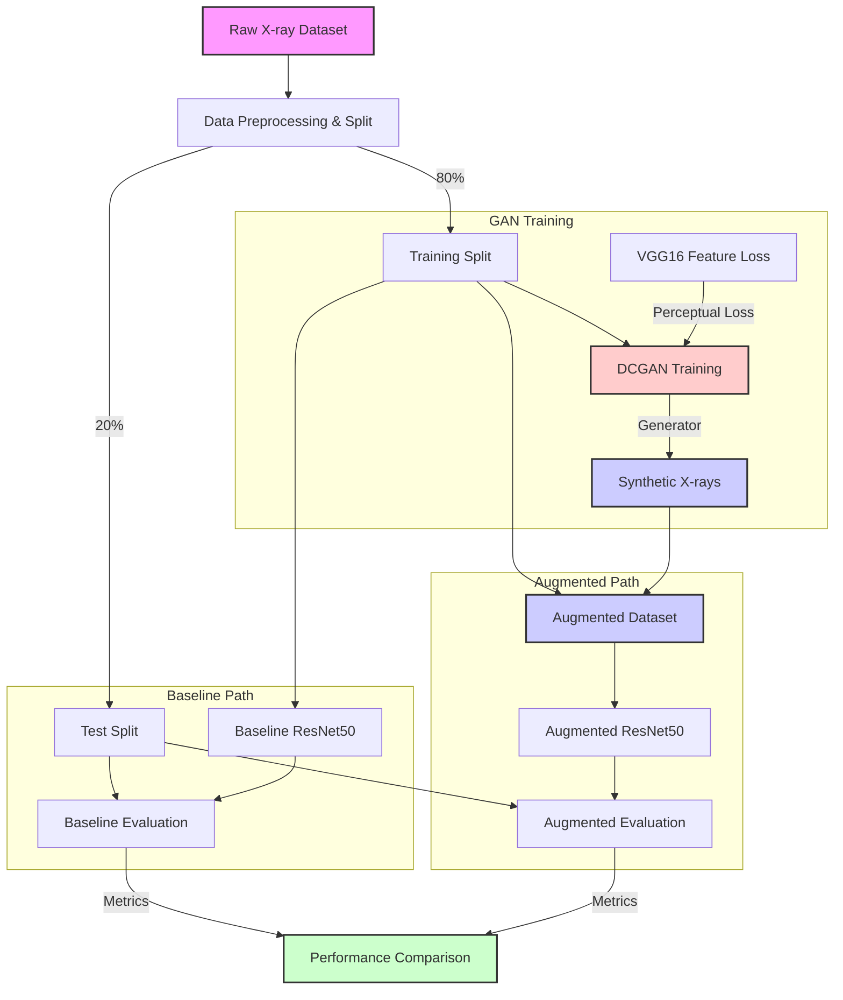

# gan-enhanced-pneumonia-classifier

Enhancing Pneumonia Detection with GAN-Generated Synthetic Chest X-rays



## 1. Task
This project seeks to create realistic synthetic X-ray images of lungs with pneumonia using a Generative Adversarial Network (GAN) and assess their effect on enhancing a deep learning classifier's performance. By enriching the dataset with high-quality synthetic images, we aim to boost model accuracy and generalization, especially in scenarios with scarce medical data. The difficulty is in ensuring these images maintain authentic anatomical features and pneumonia-specific traits, like lung opacities, while preventing artifacts that might confuse the classifier. The synthetic images must faithfully represent pneumonia signs without adding deceptive patterns that could harm classifier effectiveness.  

## 2. Related Work
Generative Adversarial Networks (GANs) have progressed synthetic image creation in medical imaging. Goodfellow et al. (2014) pioneered GANs, achieving lifelike image generation, though initial versions grappled with instability and poor quality [1]. Frid-Adar et al. (2018) employed GANs to enhance liver lesion datasets, boosting CNN accuracy, yet struggled with realism for intricate anatomies [2]. Yi et al. (2019) surveyed GANs in medical contexts, citing X-ray augmentation wins but underscoring problems with retaining diagnostic traits [3]. Kazeminia et al. (2020) evaluated GANs for medical image tasks, stressing X-ray synthesis promise while noting challenges in pathology-specific detail capture [4]. These works expose flaws in anatomical accuracy and feature retention—gaps we tackle with conditional generation and improved loss functions.

## 3. Approach
We will implement a Deep Convolutional GAN (DCGAN) using PyTorch to generate synthetic chest X-rays, conditioned on pneumonia labels to ensure relevant feature synthesis. To improve realism, we'll augment the standard adversarial loss with a perceptual loss using a pre-trained VGG-16 network, encouraging anatomical detail preservation. We'll adapt the open-source DCGAN implementation from PyTorch's examples, adding custom code for label conditioning and perceptual loss. Synthetic images will be generated (targeting 5,000 additional samples), processed (resized to 224x224, normalized), and combined with the original training set. A pre-trained ResNet-50 classifier will then be fine-tuned on this augmented dataset using cross-entropy loss, with performance compared against a baseline trained on the original data alone. 

## 4. Dataset and Metrics
The project utilizes the RSNA Pneumonia Processed Dataset from Kaggle ([link](https://www.kaggle.com/datasets/iamtapendu/rsna-pneumonia-processed-dataset)), which includes 26,684 pre-processed chest X-ray images labeled as "Normal," "No Lung Opacity/Not Normal," or "Lung Opacity," divided into 21,347 training and 5,337 testing images; since the dataset is already resized and normalized, minimal pre-processing is required, though we'll ensure synthetic images align with this format. Our metric is classification accuracy, defined as the proportion of correctly classified images in a binary setup—collapsing "No Lung Opacity/Not Normal" into "Normal" versus "Lung Opacity" for pneumonia detection—aiming for over 85% accuracy on the test set, exceeding the baseline ResNet-50's approximate 80% on the original dataset alone, validated through 5-fold cross-validation.

## 5. File Structure
```
gan-enhanced-pneumonia-classifier/
│
├── .gitignore          
├── README.md           # Project overview, setup instructions, and results
├── requirements.txt    # Project dependencies with kaggle and other packages
│
├── data/
│   ├── raw/            # Raw dataset downloaded from Kaggle
│   └── processed/      # Processed data with train/test and class splits
│
├── models/             # Saved model checkpoints (GAN generator/discriminator, classifier)
│
├── notebooks/          # Jupyter notebooks for exploration, experimentation, visualization
│
├── results/
│   ├── figures/        # Generated figures and plots
│   └── metrics/        # Evaluation metrics (e.g., accuracy scores, loss curves)
│
├── src/
│   ├── __init__.py
│   ├── data_loader.py  # Data loading with path handling and dataset verification
│   ├── download_dataset.py # Kaggle API integration for dataset acquisition
│   ├── dcgan.py        # DCGAN model implementation (generator, discriminator)
│   ├── classifier.py   # ResNet-50 implementation with pretrained weights
│   ├── train_gan.py    # Script to train the GAN
│   ├── train_classifier.py # Script to train the classifier with cross-validation
│   └── utils.py        # Utility functions
│
└── tests/              # Unit tests for the source code
    └── __init__.py
```

## 6. Setup and Usage

### Prerequisites

- Python 3.7+
- PyTorch 1.9+
- CUDA-compatible GPU (optional but recommended)

### Installation

1. Clone the repository:
   ```bash
   git clone https://github.com/yourusername/gan-enhanced-pneumonia-classifier.git
   cd gan-enhanced-pneumonia-classifier
   ```

2. Create and activate a virtual environment (Recommended):
   - Using a virtual environment isolates project dependencies.
   - **Windows:**
     ```powershell
     py -m venv .venv
     .\.venv\Scripts\activate
     ```
   - **macOS/Linux:**
     ```bash
     python3 -m venv .venv
     source .venv/bin/activate
     ```
   - Your terminal prompt should now show `(.venv)` at the beginning.

3. Install dependencies (inside the activated environment):
   ```bash
   pip install -r requirements.txt
   ```

4. Install PyTorch with CUDA support:
   - The base requirements only install CPU versions of PyTorch.
   ```bash
   pip install torch==2.5.1+cu121 torchvision==0.20.1+cu121 --index-url https://download.pytorch.org/whl/cu121
   ```
   - For the latest PyTorch versions and CUDA compatibility, visit [pytorch.org/get-started/locally](https://pytorch.org/get-started/locally/)
   - To verify your installation is using CUDA:
   ```bash
   python -c "import torch; print('CUDA available:', torch.cuda.is_available());"
   ```

5. Set up Kaggle API:
   - Create a Kaggle account if you don't have one: [Kaggle](https://www.kaggle.com/)
   - Go to your account settings (https://www.kaggle.com/account)
   - Scroll down to the API section and click "Create New API Token"
   - This will download a `kaggle.json` file with your credentials
   - Create a `.kaggle` directory in your home folder and place the `kaggle.json` file there:
     ```bash
     mkdir -p ~/.kaggle
     cp /path/to/downloaded/kaggle.json ~/.kaggle/
     chmod 600 ~/.kaggle/kaggle.json  # Set appropriate permissions
     ```

### Dataset Preparation

1. Download the RSNA Pneumonia Processed dataset:
   ```bash
   python src/download_dataset.py
   ```
   This script will:
   - Download the specified dataset from Kaggle (`iamtapendu/rsna-pneumonia-processed-dataset` by default)
   - Extract the dataset into the target directory (e.g., `./data/processed`)
   - The dataset is expected to already contain the necessary `train/` and `test/` structure with class subfolders.

2. Verify the dataset structure:
   ```bash
   python src/data_loader.py
   ```
   This will check if the dataset is properly loaded and show sample data.

### Training the Baseline Classifier

Run the baseline ResNet50 classifier training:

```bash
python src/train_classifier.py
```

Optional arguments:
- `--data-dir`: Path to the processed dataset (default: ./data/processed)
- `--epochs`: Number of training epochs (default: 15)
- `--batch-size`: Batch size for training (default: 32)
- `--lr`: Learning rate (default: 0.001)
- `--unfreeze`: Unfreeze base ResNet layers for fine-tuning
- `--k-folds`: Number of folds for cross-validation (default: 5, set to 0 to disable)
- `--cpu`: Force use of CPU even if CUDA is available

### Training the GAN (Coming Soon)

Instructions for GAN training will be added.

## 7. References
[1] Goodfellow, I., et al. (2014). Generative Adversarial Nets. *Advances in Neural Information Processing Systems*.

[2] Frid-Adar, M., et al. (2018). GAN-based synthetic medical image augmentation for increased CNN performance in liver lesion classification. *Neurocomputing*.

[3] Yi, X., et al. (2019). Generative Adversarial Network in Medical Imaging: A Review. *Medical Image Analysis*.

[4] Kazeminia, S., et al. (2020). GANs for Medical Image Analysis. *arXiv preprint arXiv:2006.01668*.


 
