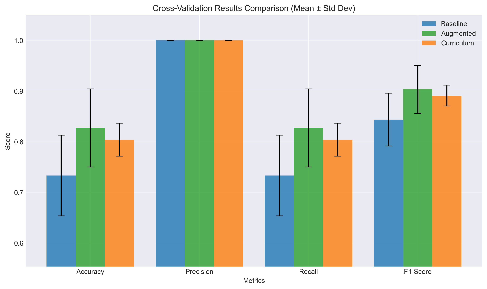
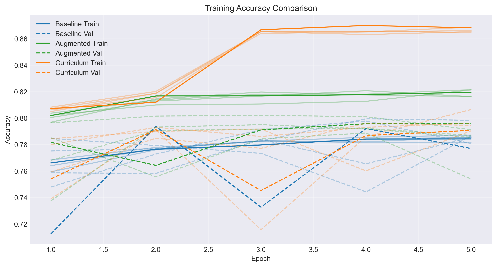
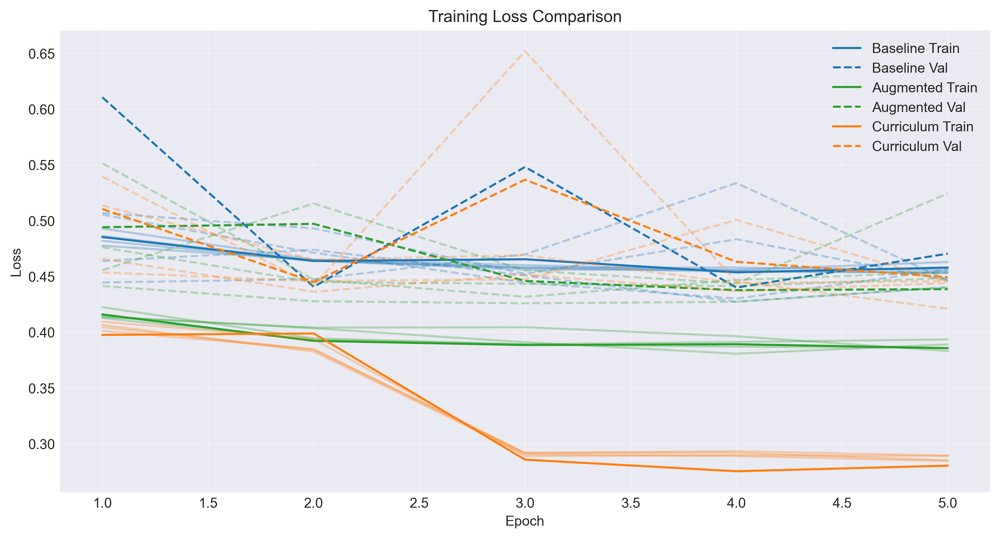
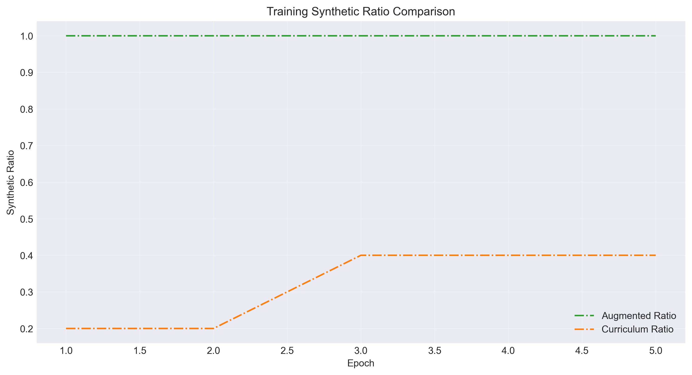
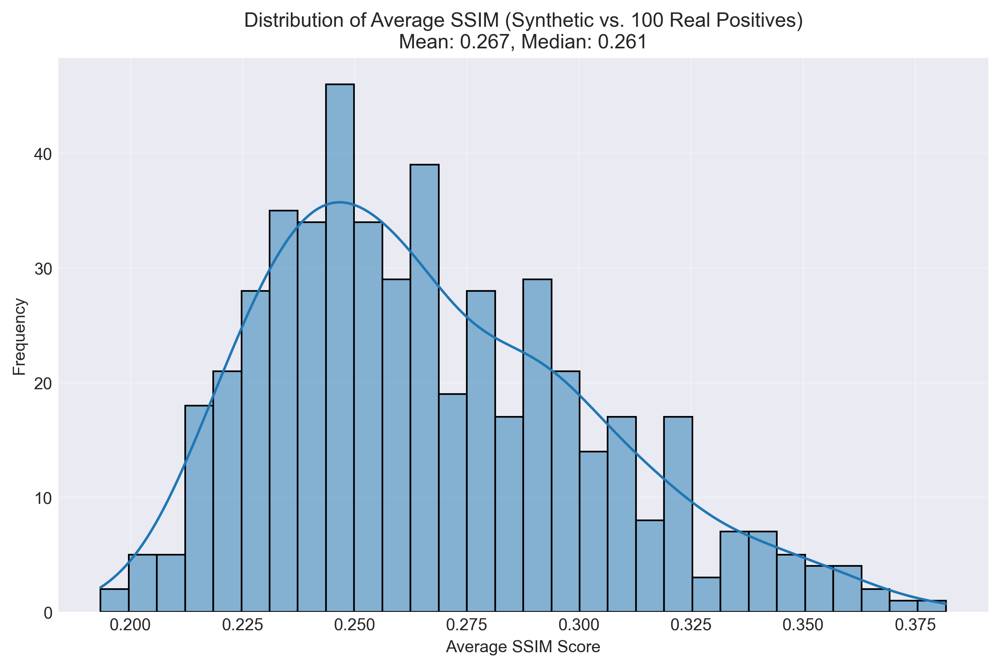
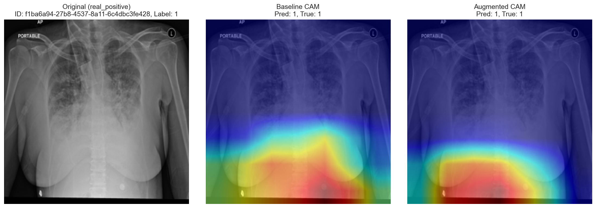
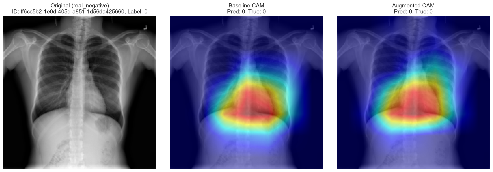
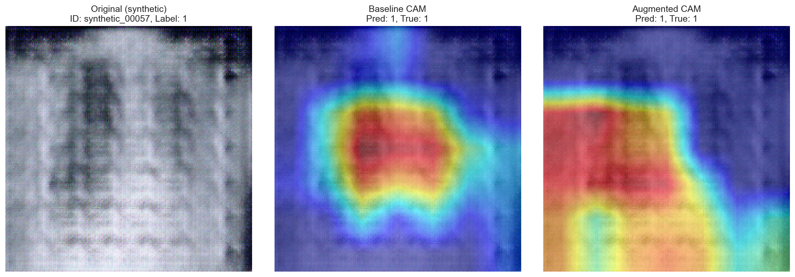

# gan-enhanced-pneumonia-classifier

Enhancing Pneumonia Detection with GAN-Generated Synthetic Chest X-rays

## Table of Contents
- [Task](#1-task)
- [Related Work](#2-related-work)
- [Approach](#3-approach)
- [Dataset and Metrics](#4-dataset-and-metrics)
- [File Structure](#5-file-structure)
- [Setup and Usage](#6-setup-and-usage)
  - [Prerequisites](#prerequisites)
  - [Installation](#installation)
  - [Dataset Preparation](#dataset-preparation)
  - [Training the Baseline Classifier](#training-the-baseline-classifier)
  - [Training the GAN](#training-the-gan)
  - [Generating Synthetic Images](#generating-synthetic-images)
  - [Training the Augmented Classifier](#training-the-augmented-classifier)
  - [Analyzing Results](#analyzing-results)
- [Results](#7-results)
  - [Experimental Setup](#experimental-setup)
  - [Evaluation Metrics](#evaluation-metrics)
  - [Performance Comparison](#performance-comparison)
  - [Synthetic Image Quality Analysis](#synthetic-image-quality-analysis)
  - [Conclusion](#conclusion)
- [Contributions](#9-contributions)
- [References](#10-references)

## 1. Task
This project seeks to create realistic synthetic X-ray images of lungs with pneumonia using a Generative Adversarial Network (GAN) and assess their effect on enhancing a deep learning classifier's performance. By enriching the dataset with high-quality synthetic images, we aim to boost model accuracy and generalization, especially in scenarios with scarce medical data. The difficulty is in ensuring these images maintain authentic anatomical features and pneumonia-specific traits, like lung opacities, while preventing artifacts that might confuse the classifier. The synthetic images must faithfully represent pneumonia signs without adding deceptive patterns that could harm classifier effectiveness.  

## 2. Related Work
Generative Adversarial Networks (GANs) have progressed synthetic image creation in medical imaging. Goodfellow et al. (2014) pioneered GANs, achieving lifelike image generation, though initial versions grappled with instability and poor quality [1]. Frid-Adar et al. (2018) employed GANs to enhance liver lesion datasets, boosting CNN accuracy, yet struggled with realism for intricate anatomies [2]. Yi et al. (2019) surveyed GANs in medical contexts, citing X-ray augmentation wins but underscoring problems with retaining diagnostic traits [3]. Kazeminia et al. (2020) evaluated GANs for medical image tasks, stressing X-ray synthesis promise while noting challenges in pathology-specific detail capture [4]. These works expose flaws in anatomical accuracy and feature retention—gaps we tackle with conditional generation and improved loss functions.

## 3. Approach

The diagram below illustrates the overall workflow of the project, from data preparation to model training and analysis:


We implement several Generative Adversarial Network (GAN) architectures using PyTorch to generate synthetic chest X-rays:
*   **Deep Convolutional GAN (DCGAN):** A baseline implementation (`dcgan.py`, `train_gan.py`). Training stability is enhanced using label smoothing (real labels set to 0.9). The generator uses `torch.nn.ConvTranspose2d` and the discriminator uses `torch.nn.Conv2d`, trained with Binary Cross-Entropy loss.
*   **Conditional GAN (CGAN):** An extension (`cgan.py`, `train_cgan.py`) that allows generating images conditioned on class labels (Pneumonia/Normal). This enables more targeted data augmentation.
*   **Wasserstein GAN with Gradient Penalty (WGAN-GP):** An advanced architecture (`wggan.py`, `train_wggan.py`) known for improved training stability and potentially higher-quality image generation by using the Wasserstein distance and a gradient penalty.

**Augmentation Strategy:**
We compare three training strategies for the classifier (a pre-trained ResNet-50 from `torchvision.models`):
1.  **Baseline:** Trained only on the original dataset.
2.  **Augmented:** Trained on the original dataset concatenated with all generated synthetic images (aiming for ~5,000).
3.  **Curriculum:** Trained on a mix of original and synthetic data, where the proportion of synthetic data is gradually increased during training according to a defined schedule (e.g., 0% synthetic for epochs 0-4, 25% for epochs 5-9, 50% thereafter). This is controlled via the `--use-curriculum` and `--curriculum-schedule` arguments in `train_classifier.py`.

All images (real and synthetic) are resized to 224x224 and normalized using ImageNet statistics. The classifier is fine-tuned using cross-entropy loss. Performance is evaluated using cross-validation and compared across the three strategies.

**Synthetic Image Quality Analysis:**
To assess the quality and impact of synthetic images, we perform additional analysis in `analyze_results.py`:
*   **Structural Similarity Index (SSIM):** We calculate the average SSIM score between each synthetic image and a reference set of real pneumonia images. The distribution of these scores helps quantify the visual similarity.
*   **Gradient-weighted Class Activation Mapping (Grad-CAM):** We generate Grad-CAM heatmaps for both baseline and augmented/curriculum models on sample images (real positive, real negative, synthetic). This visualizes which image regions the models focus on for classification, allowing comparison of attention patterns between models trained with and without synthetic data.

## 4. Dataset and Metrics
The project utilizes the RSNA Pneumonia Detection Challenge dataset from Kaggle ([link](https://www.kaggle.com/c/rsna-pneumonia-detection-challenge)), specifically using a pre-processed version available at ([link](https://www.kaggle.com/datasets/iamtapendu/rsna-pneumonia-processed-dataset)). This version includes metadata files (`stage2_train_metadata.csv`, `stage2_test_metadata.csv`) and corresponding PNG images located in `Training/Images/` and `Test/` directories within the download. The training metadata contains class labels ("Normal," "No Lung Opacity/Not Normal," "Lung Opacity"), while the test metadata uses a "PredictionString" format. The dataset comprises approximately 26,684 training images and 6,671 test images (actual numbers may vary slightly based on the metadata). Our `data_loader.py` script processes this structure, converting it into a binary classification task: "Lung Opacity" is mapped to label 1 (positive class), while all other classes ("Normal", "No Lung Opacity/Not Normal") are mapped to label 0 (negative class). Standard ImageNet normalization and resizing to 224x224 via `torchvision.transforms` are applied. Our primary metric is classification accuracy, aiming for over 85% on the test set, compared against a baseline ResNet-50's performance (initially around 80%). We also track weighted precision, recall, and F1-score to account for potential class imbalance. Validation is performed using 5-fold cross-validation by default, configurable via script arguments.

## 5. File Structure
```
gan-enhanced-pneumonia-classifier/
│
├── .gitignore           # Git ignore rules
├── .gitattributes      # Git attributes configuration
├── LICENSE             # Project license
├── README.md           # Project documentation
├── requirements.txt    # Project dependencies
│
├── data/
│   ├── processed/      # Location for the downloaded and extracted dataset
│   │   ├── stage2_train_metadata.csv
│   │   ├── stage2_test_metadata.csv
│   │   ├── Training/
│   │   │   └── Images/ # Training PNG images
│   │   └── Test/       # Test PNG images
│   └── synthetic/      # Generated synthetic images
│
├── models/
│   ├── baseline_resnet50.pth      # Baseline classifier checkpoint
│   ├── augmented_resnet50.pth     # Augmented classifier checkpoint
│   └── gan/                       # GAN model checkpoints
│       ├── generator_final.pth
│       └── discriminator_final.pth
│
├── notebooks/          # Jupyter notebooks for exploration and visualization
│
├── results/
│   ├── figures/        # Training curves, CV plots, Ratio plots
│   │   ├── baseline_*.png
│   │   ├── augmented_*.png
│   │   └── curriculum_*.png
│   ├── metrics/        # Training and evaluation metrics JSON files
│   │   ├── baseline_*.json
│   │   ├── augmented_*.json
│   │   └── curriculum_*.json
│   ├── analysis/       # SSIM plots, Grad-CAM images, comparison reports
│   │   ├── ssim_distribution.png
│   │   ├── gradcam_*.png
│   │   └── comparison_report.txt
│   └── gan_images/     # GAN-generated sample images during training
│
├── src/
│   ├── __init__.py
│   ├── analyze_results.py    # Results analysis and visualization
│   ├── classifier.py         # ResNet50 model implementation
│   ├── data_loader.py       # Dataset loading and preprocessing
│   ├── dcgan.py             # DCGAN architecture implementation
│   ├── cgan.py              # Conditional GAN (CGAN) architecture
│   ├── wggan.py             # Wasserstein GAN with Gradient Penalty (WGAN-GP) architecture
│   ├── download_dataset.py   # Dataset download script
│   ├── generate_synthetic.py # Synthetic image generation (using DCGAN)
│   ├── generate_synthetic_cgan.py # Synthetic image generation (using CGAN)
│   ├── generate_synthetic_wgan.py # Synthetic image generation (using WGAN-GP)
│   ├── train_classifier.py   # Classifier training script
│   ├── train_gan.py         # DCGAN training script
│   ├── train_cgan.py        # CGAN training script
│   ├── train_wggan.py       # WGAN-GP training script
│   └── utils.py             # Utility functions
│
└── tests/              # Unit tests for source code
    └── __init__.py

```

The project follows a modular structure:

- **Source Code (`src/`)**: Core implementation files
  - Model architectures (`classifier.py`, `dcgan.py`, `cgan.py`, `wggan.py`)
  - Training scripts (`train_classifier.py`, `train_gan.py`, `train_cgan.py`, `train_wggan.py`)
  - Data handling (`data_loader.py`, `download_dataset.py`)
  - Analysis tools (`analyze_results.py`)

- **Data Management (`data/`)**: 
  - Original dataset in `processed/`
  - Synthetic images in `synthetic/`

- **Results (`results/`)**:
  - Training metrics and evaluation results
  - Performance visualizations
  - Analysis reports and comparisons
  - Generated samples from GAN

- **Models (`models/`)**: 
  - Saved model checkpoints
  - Both baseline and augmented versions

Each component is designed to be modular and reusable, with clear separation of concerns between data processing, model implementation, training, and analysis.

## 6. Setup and Usage

### Prerequisites

- Python 3.7+
- PyTorch 1.9+
- CUDA-compatible GPU (optional but recommended)

### Installation

1. **Clone the repository**
   ```bash
   git clone https://github.com/yourusername/gan-enhanced-pneumonia-classifier.git
   cd gan-enhanced-pneumonia-classifier
   ```

2. **Create and activate a virtual environment**
   ```bash
   # Windows
   py -m venv .venv
   .\.venv\Scripts\activate

   # macOS/Linux
   python3 -m venv .venv
   source .venv/bin/activate
   ```

3. **Install dependencies**
   ```bash
   pip install -r requirements.txt
   ```

4. **Install PyTorch with CUDA support**
   ```bash
   pip install torch==2.5.1+cu121 torchvision==0.20.1+cu121 --index-url https://download.pytorch.org/whl/cu121
   ```

5. **Set up Kaggle API**
   - Create a Kaggle account at [Kaggle](https://www.kaggle.com/)
   - Go to your account settings
   - Create new API token
   - Set up credentials:
     ```bash
     mkdir -p ~/.kaggle
     cp /path/to/downloaded/kaggle.json ~/.kaggle/
     chmod 600 ~/.kaggle/kaggle.json
     ```

### Dependencies
Install core dependencies:
```bash
pip install -r requirements.txt
```
This now includes `scikit-image` (for SSIM) and `grad-cam` (for Grad-CAM analysis).

Ensure you have PyTorch with CUDA support if applicable:
```bash
pip install torch==2.5.1+cu121 torchvision==0.20.1+cu121 --index-url https://download.pytorch.org/whl/cu121
```

### Dataset Preparation

1. **Download the dataset**
   ```bash
   python src/download_dataset.py
   ```

2. **Verify dataset structure**
   After running the download script, check the `./data/processed/` directory. You should see the following structure:
   ```
   ./data/processed/
   ├── stage2_train_metadata.csv
   ├── stage2_test_metadata.csv
   ├── Training/
   │   └── Images/  # Contains training PNGs
   └── Test/        # Contains test PNGs
   ```
   You can also run `python src/data_loader.py --data-dir ./data/processed` which will test loading the dataset and report basic statistics if successful, or errors if the structure is incorrect.

### Training the Baseline Classifier

**Basic training (5-fold CV):**
```bash
python src/train_classifier.py --k-folds 5
```
This saves metrics as `baseline_*.json` and model as `baseline_resnet50.pth` (or `fold_X_baseline_resnet50.pth` for CV).

### Training the GAN

**Train DCGAN (Basic):**
```bash
python src/train_gan.py
```

**Train CGAN:**
```bash
# Requires class labels during training
python src/train_cgan.py --n-classes 2 
```

**Train WGAN-GP:**
```bash
python src/train_wggan.py
```

**Common GAN training options:**
(Apply similarly to `train_gan.py`, `train_cgan.py`, `train_wggan.py`)
```bash
--data-dir PATH     # Path to the processed dataset directory (default: ./data/processed)
--model-dir PATH    # Base directory to save model checkpoints (GAN models saved under ./models/{gan_type}/) (default: ./models)
--output-dir PATH   # Base directory for outputs (generated images saved to ./results/gan_images/) (default: ./results)
--results-dir PATH  # Directory to save training history JSON (gan_training_history.json) (default: ./results/metrics)
--figures-dir PATH  # Directory to save generated plot images (gan_loss_curve.png) (default: ./results/figures)
--epochs N         # Number of training epochs (default: 50)
--batch-size N     # Batch size for training (default: 128)
--lr FLOAT        # Learning rate for Adam optimizer (default: 0.0002)
--beta1 FLOAT     # Beta1 hyperparameter for Adam optimizers (default: 0.5)
--latent-dim N    # Size of the latent z vector (default: 100)
--num-channels N  # Number of image channels (default: 3)
--feature-maps-g N # Base feature maps for Generator (default: 64)
--feature-maps-d N # Base feature maps for Discriminator (default: 64)
--workers N       # Number of data loading workers (default: 4)
--vis-batch-size N # Batch size for generating visualization images (default: 64)
--cpu             # Force CPU usage
```
*Note: Specific hyperparameters (like `lr`, `beta1`, `feature-maps`) might need tuning for different GAN types. CGAN requires `--n-classes`. WGAN-GP uses different optimizer settings internally.*

### Generating Synthetic Images

1. **Generate images using trained DCGAN:**
   ```bash
   python src/generate_synthetic.py --model-path ./models/gan/generator_final.pth
   ```

2. **Generate images using trained CGAN:**
   ```bash
   # Specify number of classes and model path
   python src/generate_synthetic_cgan.py --model-path ./models/cgan/generator_final.pth --n-classes 2 --num-images-per-class 2500
   ```

3. **Generate images using trained WGAN-GP:**
   ```bash
   python src/generate_synthetic_wgan.py --model-path ./models/wggan/generator_final.pth
   ```

4. **Common generation options:**
   (Apply similarly to `generate_synthetic*.py` scripts)
   ```bash
   --model-path PATH  # Path to the trained generator checkpoint (required)
   --output-dir PATH  # Output directory for synthetic images (default: ./data/synthetic)
   --num-images N     # Number of images to generate (DCGAN, WGAN-GP) (default: 5000)
   --num-images-per-class N # Number of images per class (CGAN) (default: 2500)
   --latent-dim N     # Latent vector size (must match training) (default: 100)
   --feature-maps-g N # Generator base feature maps (must match training) (default: 64)
   --n-classes N      # Number of classes (CGAN only) (default: 2)
   --batch-size N     # Batch size for generation (default: 64)
   --cpu              # Force CPU usage
   ```
   *Ensure `--latent-dim`, `--feature-maps-g`, and `--n-classes` (for CGAN) match the parameters used during training.*

### Training the Augmented Classifier (Simple Concatenation)

**Train with all synthetic data (5-fold CV):**
```bash
python src/train_classifier.py --use-synthetic --k-folds 5
```
This saves metrics as `augmented_*.json` and model as `augmented_resnet50.pth` (or `fold_X_augmented_resnet50.pth` for CV).

### Training the Augmented Classifier (Curriculum Learning)

**Train with phased synthetic data (5-fold CV):**
```bash
python src/train_classifier.py --use-synthetic --use-curriculum --k-folds 5
```

**Customize curriculum schedule (e.g., 0% up to epoch 3, 30% up to epoch 8, 60% thereafter):**
```bash
python src/train_classifier.py \
    --use-synthetic \
    --use-curriculum \
    --curriculum-schedule \"0:0.0, 3:0.3, 8:0.6\" \
    --k-folds 5 \
    --epochs 20
```
This saves metrics as `curriculum_*.json` and model as `curriculum_resnet50.pth` (or `fold_X_curriculum_resnet50.pth` for CV).

**Available options for `train_classifier.py`:**
```bash
--data-dir PATH      # Processed dataset directory (default: ./data/processed)
--synthetic-dir PATH # Synthetic images directory (default: ./data/synthetic)
--model-dir PATH     # Model save directory (default: ./models)
--results-dir PATH   # Metrics save directory (default: ./results/metrics)
--figures-dir PATH   # Figures save directory (default: ./results/figures)
--epochs N          # Training epochs (default: 15)
--batch-size N      # Batch size (default: 32)
--lr FLOAT         # Learning rate (default: 0.001)
--unfreeze         # Unfreeze base ResNet layers
--k-folds N        # Cross-validation folds (default: 5, set to 1 for single run)
--workers N        # Data loading workers (default: 4)
--use-synthetic    # Enable synthetic data augmentation (required for curriculum)
--use-curriculum   # Enable phased curriculum learning for synthetic data
--curriculum-schedule STR # Define schedule, e.g., \"0:0.0,5:0.25,10:0.5\" (default: \"0:0.0, 5:0.25, 10:0.5\")
--cpu              # Force CPU usage
```

### Analyzing Results

1.  **Run analysis script:**
    ```bash
    python src/analyze_results.py
    ```
    This script now performs several analyses:
    *   Loads metrics for `baseline`, `augmented`, and `curriculum` runs (if JSON files exist).
    *   Generates comparison plots for training curves (loss, accuracy, synthetic ratio) and CV results (accuracy, precision, recall, F1).
    *   Generates a text summary report (`comparison_report.txt`) comparing final test and CV performance across runs.
    *   Calculates and plots the SSIM distribution between synthetic images and real positive images (`ssim_distribution.png`).
    *   Generates Grad-CAM comparison images (`gradcam_*.png`) for sample images across available models.

2.  **Available options for `analyze_results.py`:**
    ```bash
    --metrics-dir PATH  # Metrics JSON files directory (default: ./results/metrics)
    --analysis-dir PATH # Output directory for reports/plots (default: ./results/analysis)
    --model-dir PATH    # Saved models directory (default: ./models)
    --data-dir PATH     # Processed (real) data directory (default: ./data/processed)
    --synthetic-dir PATH# Synthetic images directory (default: ./data/synthetic)
    --num-ssim-real N   # Number of real positive images for SSIM ref (default: 100)
    --num-ssim-synth N  # Number of synthetic images for SSIM calc (default: 500)
    --num-gradcam-samples N # Samples per category for Grad-CAM (default: 3)
    --cpu              # Force CPU for model loading/inference
    --skip-plots       # Skip training/CV comparison plots
    --skip-ssim        # Skip SSIM calculation
    --skip-gradcam     # Skip Grad-CAM generation
    ```

3.  **Generated outputs (in `./results/analysis/`):**
    *   `comparison_*.png`: Training curve comparisons.
    *   `cv_comparison.png`: Bar plot comparing CV performance.
    *   `comparison_report.txt`: Text summary of performance metrics.
    *   `ssim_distribution.png`: Histogram of synthetic image SSIM scores.
    *   `gradcam_*.png`: Grad-CAM visualizations for sample images.

## 7. Results

### Experimental Setup
We evaluated the effectiveness of GAN-generated synthetic data by comparing three training strategies for a ResNet-50 classifier:
1.  **Baseline:** Trained solely on the original RSNA dataset.
2.  **Augmented:** Trained on the original dataset combined with 5000 synthetic images generated by the DCGAN model.
3.  **Curriculum:** Trained using a curriculum learning approach where the proportion of synthetic data was gradually increased during training (20% for first two epochs, 40% thereafter), starting with the original data and the same 5000 synthetic images.

All experiments utilized a ResNet-50 model pre-trained on ImageNet, fine-tuned with cross-entropy loss. Key hyperparameters for the classifier included:
*   Optimizer: Adam
*   Learning Rate: 0.001
*   Batch Size: 32
*   Epochs: 5
*   Image Size: 224x224
*   Normalization: Standard ImageNet means and standard deviations.

The GAN (DCGAN) was trained with the following key hyperparameters:
*   Optimizer: Adam
*   Learning Rate: 0.0002
*   Beta1: 0.5
*   Batch Size: 128
*   Epochs: 30
*   Latent Dimension: 100

Hyperparameters were selected based on common practices for fine-tuning ResNet models and training GANs, with minor adjustments based on preliminary experiments.

### Evaluation Metrics
Success was measured primarily by **classification accuracy** on the test set, comparing the performance of the augmented and curriculum models against the baseline. We also tracked **weighted precision, recall, and F1-score** to account for potential class imbalance. Evaluation robustness was ensured using **5-fold cross-validation**. Synthetic image quality was assessed using the **Structural Similarity Index (SSIM)** against real pneumonia images and visualized using **Gradient-weighted Class Activation Mapping (Grad-CAM)** to understand model focus.

### Performance Comparison
The results, summarized in `results/analysis/comparison_report.txt` and visualized below, demonstrate the impact of synthetic data augmentation.

**Cross-Validation Performance:**
According to the average results across 5 folds:
*   The **Baseline** model achieved an average accuracy of 73.3%.
*   The **Augmented** model, trained with a simple concatenation of real and synthetic data, showed a significant improvement, reaching an average accuracy of 82.7% (+9.4 percentage points vs. Baseline).
*   The **Curriculum** model also outperformed the baseline with an average accuracy of 80.4% (+7.1 percentage points vs. Baseline), suggesting benefits from gradual introduction of synthetic data, although slightly less than the direct augmentation in this run.

Improvements were also observed in weighted Recall and F1-score for both augmented strategies compared to the baseline.


*Figure: Comparison of average cross-validation metrics (Accuracy, Precision, Recall, F1-Score) across Baseline, Augmented, and Curriculum strategies.*

**Training Dynamics:**
Training curves illustrate the learning progression for each strategy:


*Figure: Training and validation accuracy curves over epochs.*


*Figure: Training and validation loss curves over epochs.*


*Figure: Proportion of synthetic data used per batch during Curriculum learning.*

### Synthetic Image Quality Analysis
**SSIM:** The distribution of SSIM scores between 500 generated images and 100 real positive images indicates moderate structural similarity, suggesting the GAN captured some relevant visual features but also divergence from real examples.


*Figure: Distribution of SSIM scores comparing synthetic images to real positive X-rays.*

**Grad-CAM:** Grad-CAM visualizations help compare where the different models focus their attention. Comparing heatmaps for baseline vs. augmented/curriculum models on the same images reveals how synthetic data might influence feature learning. Below are examples for a real positive, real negative, and a synthetic image processed by the baseline and augmented models (assuming available `gradcam_..._baseline.png` and `gradcam_..._augmented.png` exist for comparison - using representative synthetic image as placeholder).

*Example Grad-CAM outputs (refer to `results/analysis/` for full set):*

| Real Positive                                                               | Real Negative                                                                 | Synthetic Sample                                                        |
| :--------------------------------------------------------------------------: | :----------------------------------------------------------------------------: | :----------------------------------------------------------------------: |
|  |  |  |

### Conclusion
Our results indicate that incorporating GAN-generated synthetic images significantly improves the performance of the pneumonia classifier compared to training only on the original data. Both the direct augmentation and curriculum learning strategies led to substantial gains in accuracy and other key metrics during cross-validation, as detailed in `results/analysis/comparison_report.txt`. While the direct augmentation showed slightly higher average accuracy in this particular set of experiments (82.7% vs 80.4% for curriculum and 73.3% for baseline), both methods demonstrate the value of GANs for enhancing medical image classification tasks, especially when data is limited. The SSIM and Grad-CAM analyses provide insights into the quality and impact of the synthetic data, guiding potential future improvements in GAN architecture or training.

## 8. Contributions

| Name   | Task                                                                                                | File names                                                                                                                                                                                             | Approx. Lines of Code |
| :----- | :-------------------------------------------------------------------------------------------------- | :----------------------------------------------------------------------------------------------------------------------------------------------------------------------------------------------------- | :-------------------- |
| Harlan | Data preprocessing<br>Classifier implementation<br>DCGAN implementation<br>Analysis scripts           | `download_dataset.py` (79)<br>`data_loader.py` (812)<br>`classifier.py` (62)<br>`dcgan.py` (122)<br>`generate_synthetic.py` (90)<br>`analyze_results.py` (657)                                                | 1822                  |
| Thai   | Classifier training<br>DCGAN training<br>CGAN implementation & training<br>WGAN-GP implementation & training | `train_classifier.py` (748)<br>`train_gan.py` (250)<br>`cgan.py` (137)<br>`train_cgan.py` (275)<br>`generate_synthetic_cgan.py` (85)<br>`wggan.py` (90)<br>`train_wggan.py` (156)<br>`generate_synthetic_wgan.py` (84) | 1825                  |

## 9. References
[1] Goodfellow, I., et al. (2014). Generative Adversarial Nets. *Advances in Neural Information Processing Systems*.

[2] Frid-Adar, M., et al. (2018). GAN-based synthetic medical image augmentation for increased CNN performance in liver lesion classification. *Neurocomputing*.

[3] Yi, X., et al. (2019). Generative Adversarial Network in Medical Imaging: A Review. *Medical Image Analysis*.

[4] Kazeminia, S., et al. (2020). GANs for Medical Image Analysis. *arXiv preprint arXiv:2006.01668*.


 
